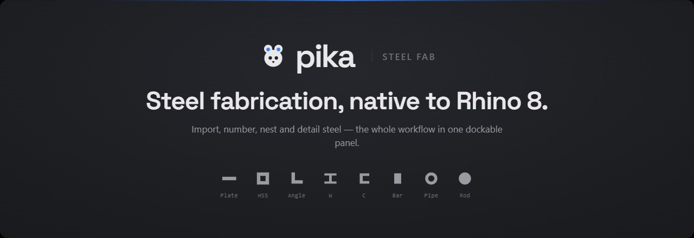
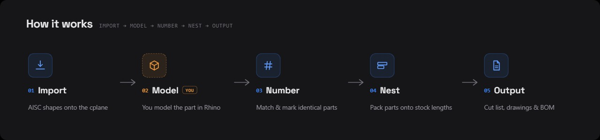
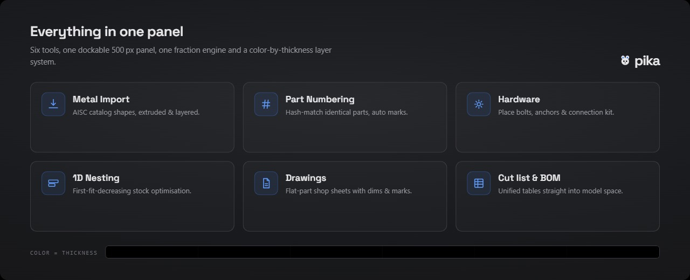

## Install

1. Go to **[Pika-dist releases](https://github.com/evanemerydesign/Pika-dist/releases)**
2. Download the latest `.yak` file
3. Open Rhino 8 — drag the `.yak` onto the viewport to install
4. Restart Rhino, then type `Pika` to open the panel

> Requires Rhino 8 or later.

## Documentation

[Full feature documentation →](https://evanemerydesign.github.io/Pika)

## Development

Built with C# · RhinoCommon · Eto.Forms · SQLite

```
src/Pika.Plugin/        ← Plugin entry point, panel registration
src/Pika.Modules/
  AssetImport/          ← Shape import, layer builder, color assignment
  Nesting/              ← 1D nesting engine (FFD bin-pack)
src/Pika.Data/          ← SQLite schema, AISC models, shape catalog, part registry
src/Pika.UI/            ← All Eto.Forms screens and dialogs
tools/Pika.Preview/     ← WPF preview harness (drive Eto UI outside Rhino)
data/aisc-catalog.db    ← Read-only AISC shape catalog
```
