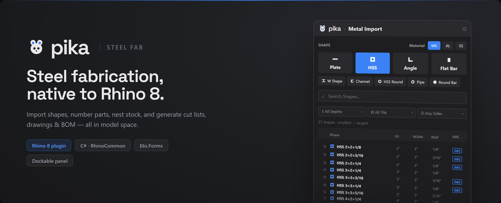
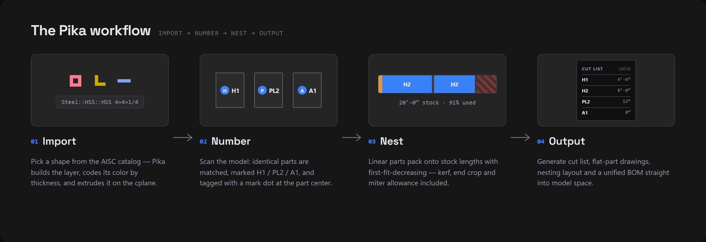
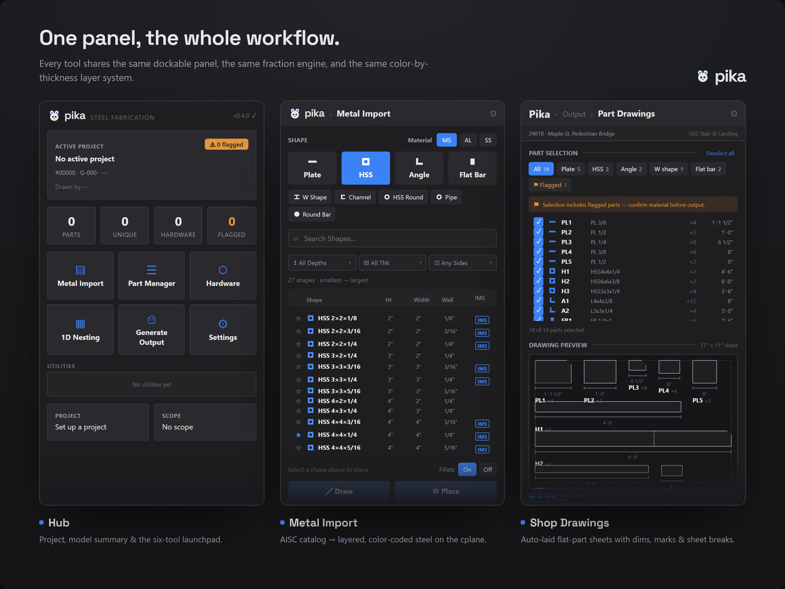
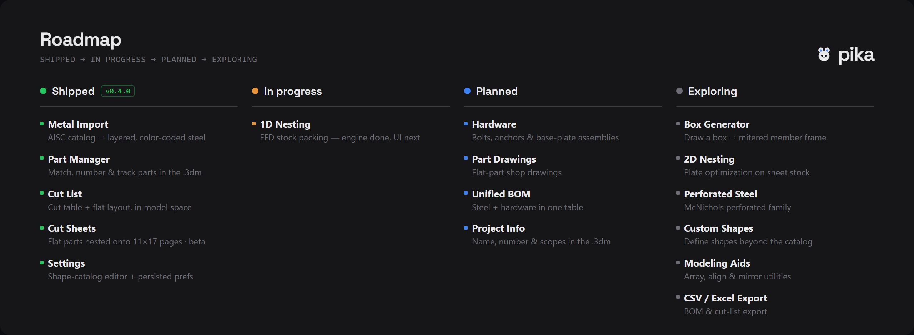

<p align="center">
  <a href="#install"></a>
  &nbsp;&nbsp;
  <a href="https://evanemerydesign.github.io/Pika"></a>
</p>

## Install

1. Download **[install-update-pika.bat](https://raw.githubusercontent.com/evanemerydesign/Pika-dist/main/install-update-pika.bat)** (right-click → *Save link as…*)
2. Close Rhino if it's open, then double-click `install-update-pika.bat`
   - If Windows shows *"Windows protected your PC,"* click **More info → Run anyway**
3. Open Rhino 8, then type `Pika` (or *Panels* menu → *Pika*) to open the panel

> Requires Rhino 8 (8.31+). Run the same file again anytime to update to the newest build.

## Documentation

[Full feature documentation →](https://evanemerydesign.github.io/Pika)

## Features




## Development

Built with C# · RhinoCommon · Eto.Forms · SQLite

```
src/Pika.Plugin/        ← Plugin entry point, panel registration
src/Pika.Modules/
  AssetImport/          ← Shape import, layer builder, color assignment
  Nesting/              ← 1D nesting engine (FFD bin-pack)
src/Pika.Data/          ← SQLite schema, AISC models, shape catalog, part registry
src/Pika.UI/            ← All Eto.Forms screens and dialogs
tools/Pika.Preview/     ← WPF preview harness (drive Eto UI outside Rhino)
data/aisc-catalog.db    ← Read-only AISC shape catalog
```

## On the roadmap



> **New in 0.4.0 (beta): Cut sheets.** Auto layouts that nest the flat cut-list cells — real
> station/gauge dims, hole crosses and Ø leaders and all — onto printable 11×17 Rhino layout
> pages, with a cover sheet + per-sheet snapshot map and a separate vendor/laser package.

Pika ships new tools steadily. These are **under development** — designed and partly built, but not yet in the shipping `.yak`:

- **1D Nesting** — *in progress* · pack parts onto stock lengths, results straight into the model
- **Hardware** — *planned* · bolts, anchors & base-plate assemblies with auto holes + CL marks
- **Drawings & Output** — *planned* · flat-part shop drawings & a unified BOM (the **cut list**
  ships as of 0.3.0, **cut sheets** as of 0.4.0)
- **Project Info** — *planned* · project & scope fields saved into the `.3dm`
- **Box Generator** — *planned* · draw a box, get a mitered member frame
- **Perforated Steel** · **Custom Shapes** — *exploring*

[See the full roadmap →](https://evanemerydesign.github.io/Pika#features)
